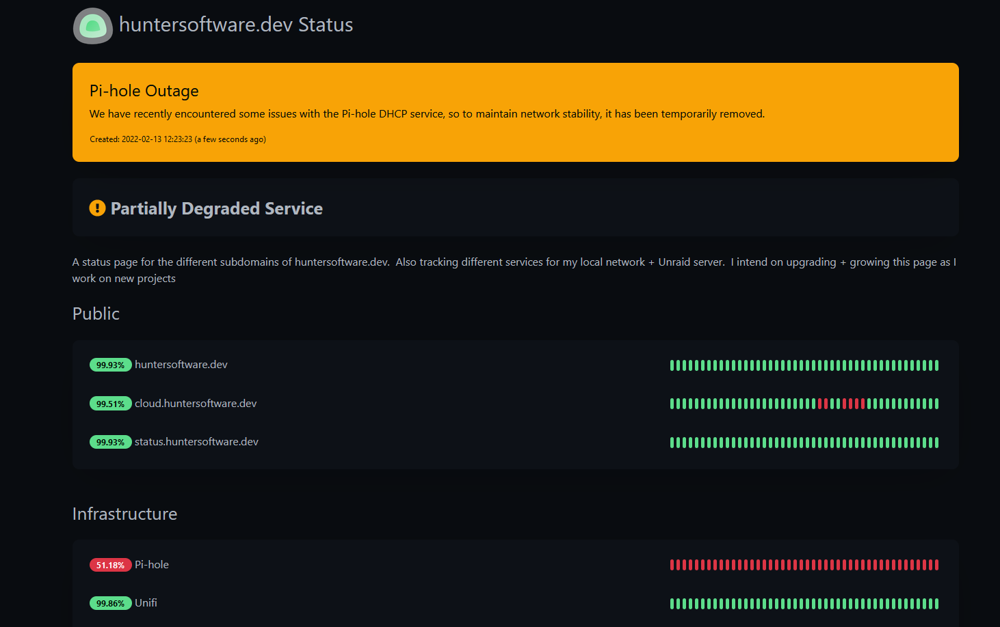

As I've slowly grown my Unraid server (more on that later), I've had an increased need for a monitoring solution.  I've always loved status pages, and in the spirit of this project, I wanted to find a self-hosted solution (as opposed to <https://www.atlassian.com/software/statuspage>), and thus I landed on [Uptime Kuma](https://github.com/louislam/uptime-kuma).

Uptime Kuma isn't the most feature-rich solution out there, but what it does, it does well.  And it has a very attractive UX - which I've discovered is fairly rare in the self-hosted domain (shout-out to [Scrutiny](https://github.com/AnalogJ/scrutiny) for also being gorgeous). 

The setup for Uptime Kuma was pretty straightforward.  Using Unraid's [Community Apps](https://unraid.net/community/apps), I was able to use the Uptime Kuma Docker Image with minimal setup.  Similarly, adding + configuring monitors was a breeze.\
\
All-in-all, you can view the finished product here: [status.huntersoftware.dev](https://status.huntersoftware.dev/status)